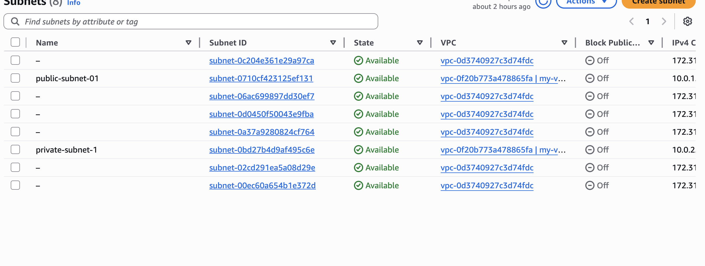
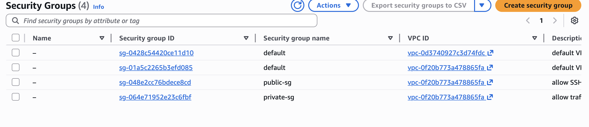
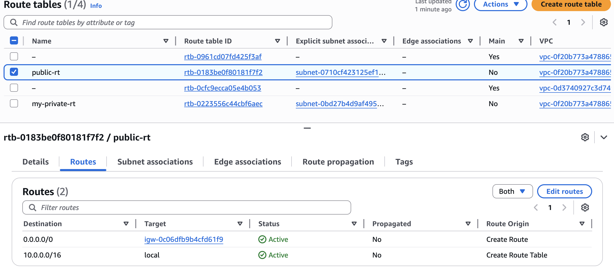
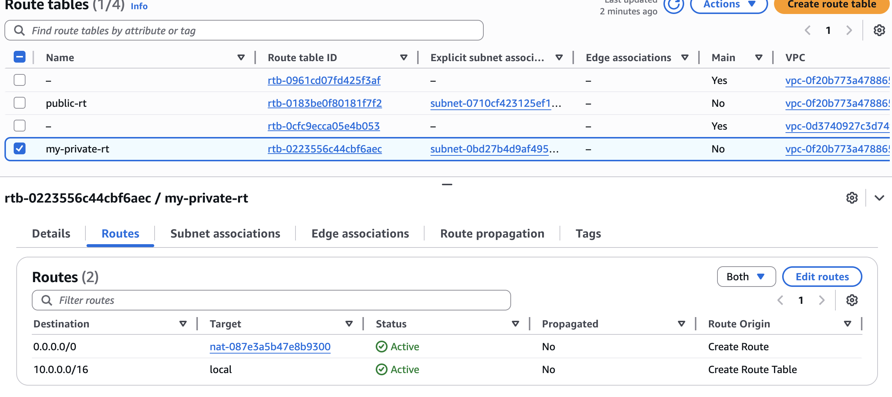
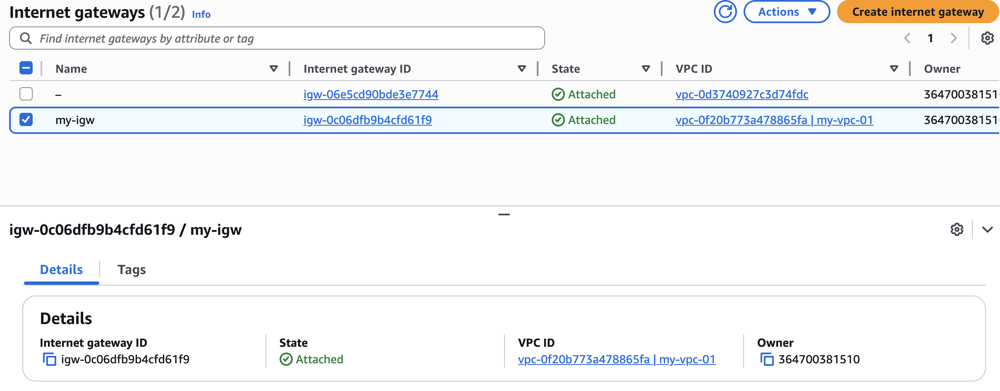
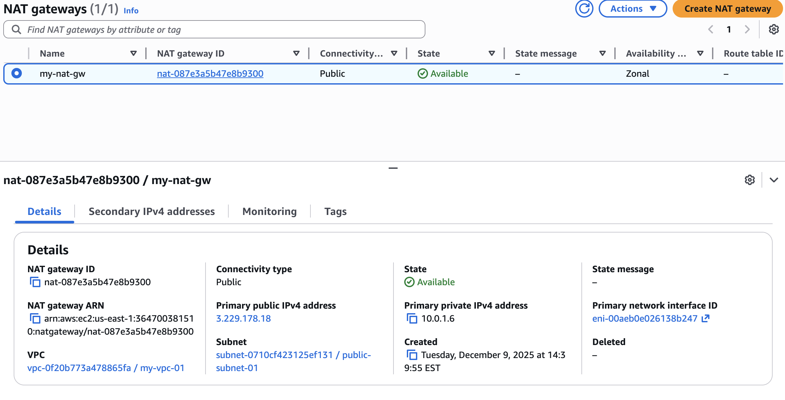
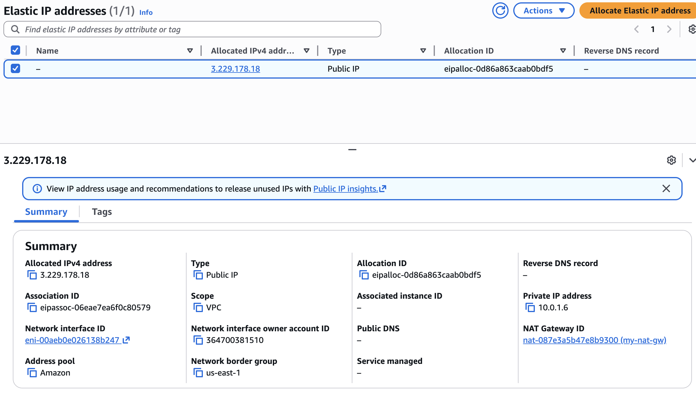
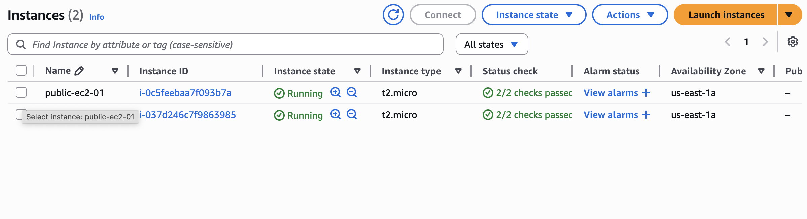
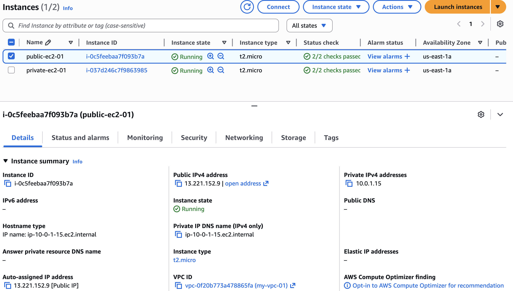

# AWS Bastion Host → Private Web Tier Architecture

## 📌 Executive Summary
This project demonstrates a real-world, production-style AWS network pattern used by modern companies:  
A **public bastion host** provides controlled SSH entry, while a **private EC2 web server** remains fully isolated from the public internet — following least privilege, segmentation, and zero-trust design.

---

## 🏗️ Architecture Diagram (ASCII)

             ┌───────────────────────────────┐
             │           Internet             │
             └───────────────────────────────┘
                           │
                     (IGW - Public)
                           │
               ┌────────────────────┐
               │  Public Subnet     │
               │  Bastion EC2       │
               │  SG: SSH allowed   │
               └────────────────────┘
                           │
                     SSH Over Private IP
                           │
            ┌─────────────────────────────┐
            │        Private Subnet       │
            │    Web EC2 (no public IP)   │
            │    SG: Allow only from SG   │
            └─────────────────────────────┘
                           │
                    0.0.0.0/0 via NAT
                           │
                     ┌─────────┐
                     │  NAT GW │
                     └─────────┘

---

## 🔐 Why This Architecture Is Used in the Real World

Companies use this pattern because:

- Web servers **should never** be exposed directly to the internet.
- SSH should only enter through a **controlled bastion host**.
- NAT Gateway gives private servers internet access **without exposing them**.
- It prevents:
  - Lateral movement  
  - External attack surface exposure  
  - Unrestricted SSH access  
  - Accidental public IP assignment  

This is one of the most common secure VPC patterns used in Fortune 500 DevOps, Cloud, and Security teams.

---

## Architecture Decisions & Trade-offs

**Bastion Host vs Direct SSH**
- Chosen to centralize and audit SSH access
- Prevents exposing private instances to the internet
- Trade-off: additional instance cost and hop

**NAT Gateway vs Public Internet Access**
- Allows outbound updates without inbound exposure
- Trade-off: NAT Gateway cost vs security benefits

**Security Group Chaining**
- Private EC2 only trusts Bastion SG, not IP ranges
- Reduces blast radius if credentials are compromised

**Why Not ALB / Auto Scaling Yet**
- Scope intentionally limited to core VPC + security patterns
- Designed as a foundational building block
- Listed as future enhancements to show roadmap thinking

---

## 🧱 Infrastructure Components

### **Networking**
- 1× VPC (10.0.0.0/16)
- 1× Public subnet (10.0.1.0/24)
- 1× Private subnet (10.0.2.0/24)
- 1× Internet Gateway (IGW)
- 1× NAT Gateway (public subnet)
- 2× Route Tables  
  - Public RT → IGW  
  - Private RT → NAT GW  

### **Compute**
- Public Bastion EC2 (t2.micro)
- Private Web EC2 (t2.micro)
- SSH allowed *only* through bastion → private instance

### **Security**
- Bastion SG:  
  - Allow SSH from my IP only  
- Private EC2 SG:  
  - Allow SSH **only** from Bastion SG  

---

## 🖼️ Project Screenshots (Evidence)

All screenshots proving the architecture are inside:  
`/screenshots`

Included:

---

## 🎯 Skills Demonstrated

This project proves hands-on experience with:

- VPC design & subnet planning  
- Secure bastion host patterns  
- NAT vs IGW routing  
- Security Group chaining (SG → SG rules)  
- Private-only web tier design  
- Route table configuration  
- IAM-less SSH access patterns  
- Infrastructure documentation and professional GitHub project layout  

This is the kind of architecture companies expect Cloud/DevOps engineers to fully understand.

---

## 🚀 Next Upgrade (Future Enhancements)

If I choose to expand this project, next steps include:

- Add ALB → private web tier  
- Add SSM Session Manager (no SSH keys!)  
- Automate the entire architecture with Terraform  
- Add CloudWatch monitoring + dashboards  
- Add an Auto Scaling Group for the private web tier  

---

## 🧑‍💻 Author
Sebastian Caballero — Cloud/DevOps Engineer.

